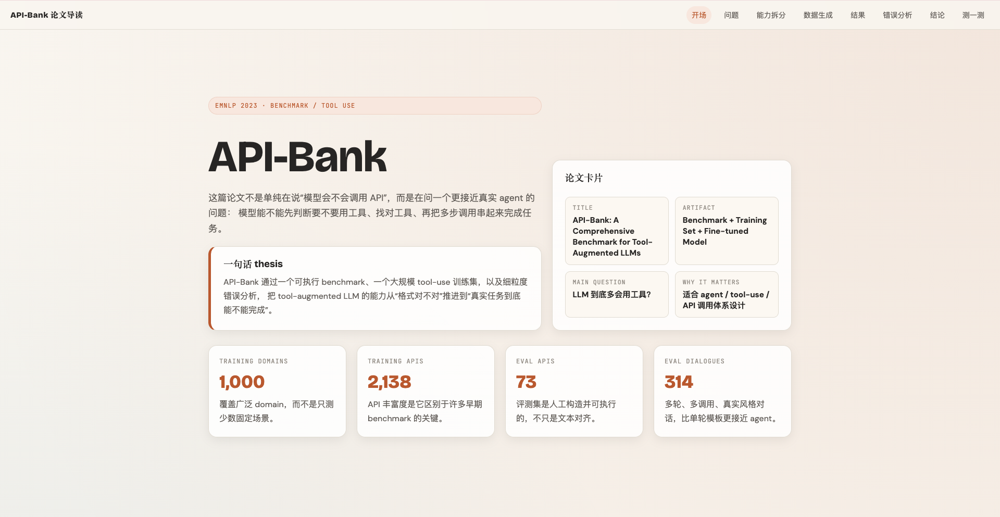
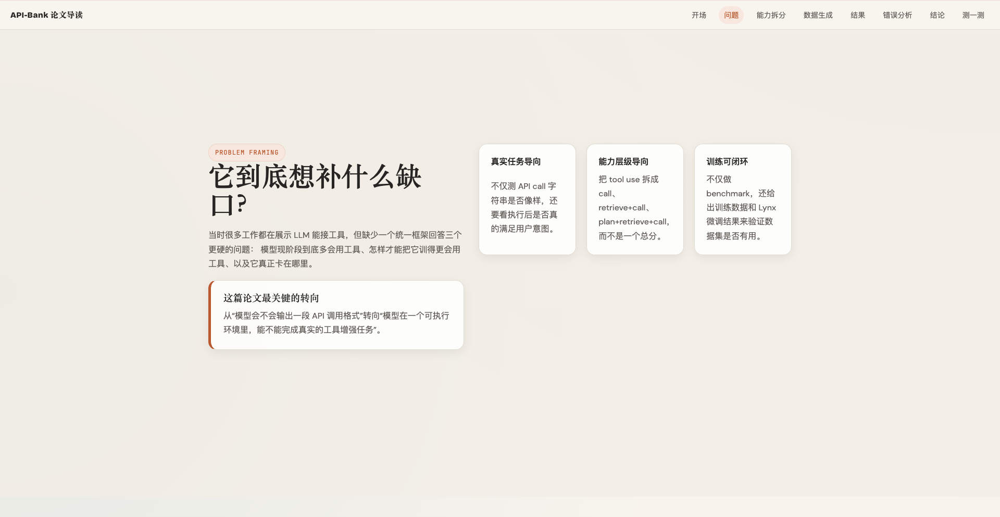
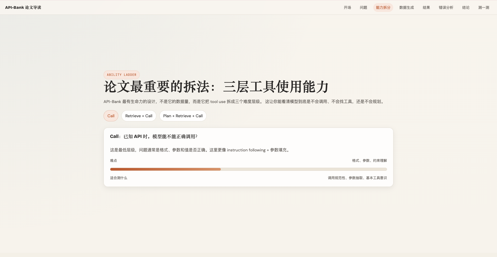
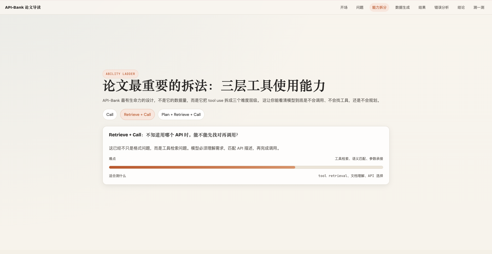
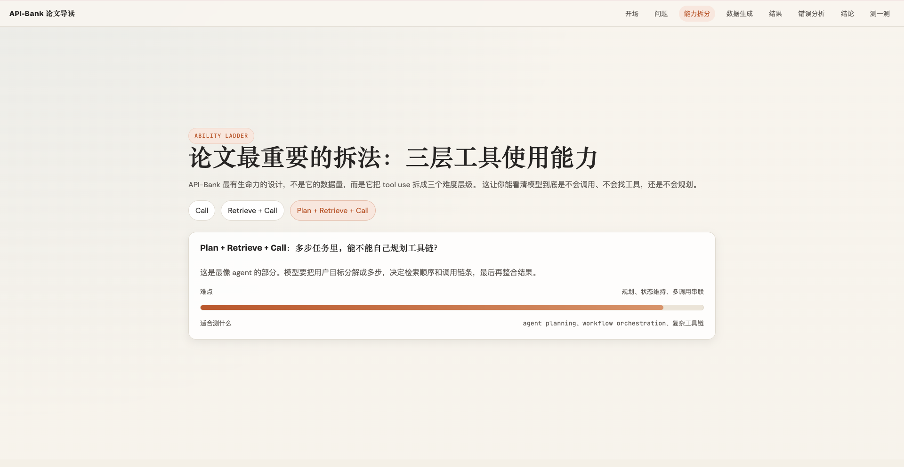
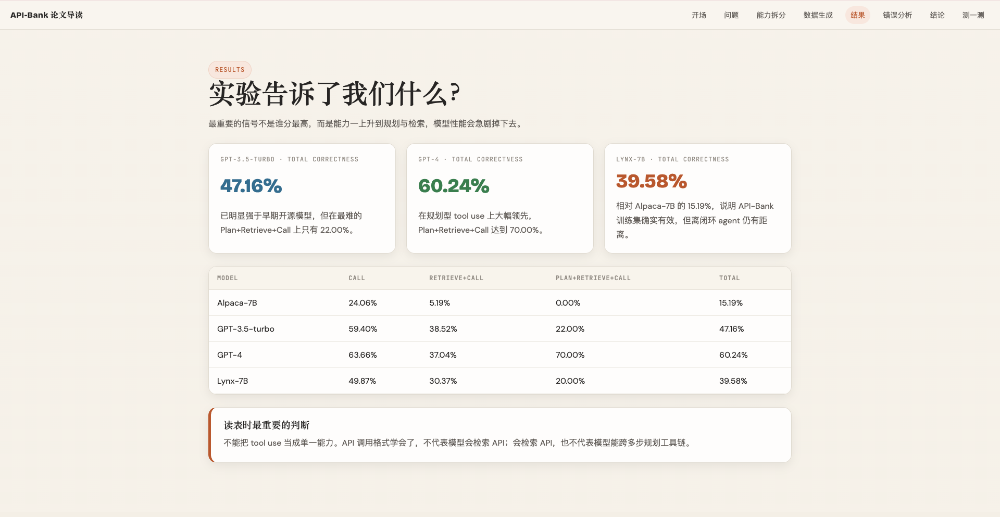
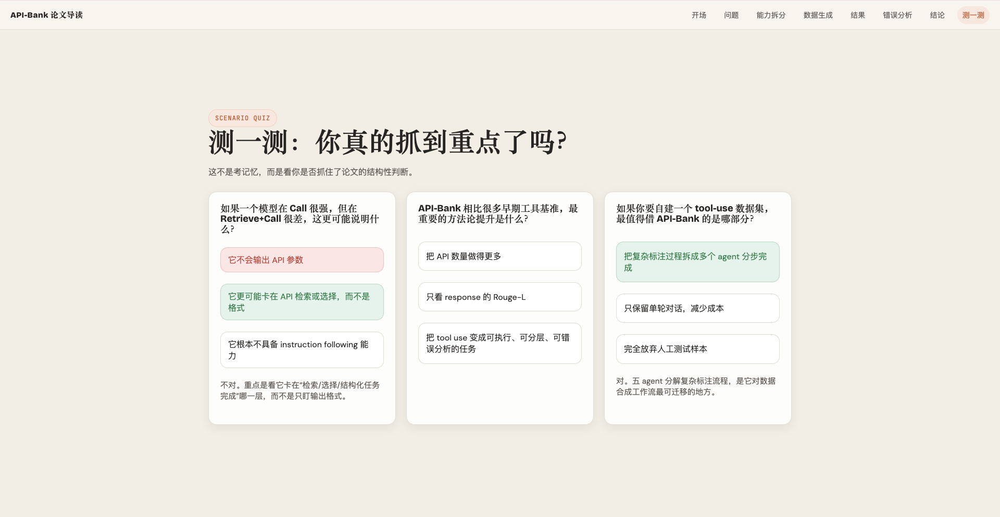

# 致谢张咋啦开源的codebase-to-course ： https://github.com/zarazhangrui/codebase-to-course

# paper-reading

A Codex skill for reading research papers and turning them into decision-grade analysis, not abstract rewrites.

Give it a paper. Get back a structured reading output that helps you decide:

- what the paper actually contributes
- what the evidence really supports
- whether it is worth reading deeper, reproducing, citing, or borrowing from

Instead of retelling a paper section by section, `paper-reading` breaks it down along the dimensions that matter for research and engineering decisions: problem framing, mechanism, evidence quality, reproducibility, transfer value, and practical judgment.

## Screenshots

### API-Bank interactive reading page





### Capability decomposition and method walkthrough







### Error analysis and final takeaways





## What this skill is for

This skill is for researchers, engineers, and technically curious readers who do not want paper summaries that just paraphrase the abstract.

It is built for people who read papers to answer practical questions like:

- What problem does this paper actually solve?
- What is genuinely new here?
- How does the method work mechanically?
- Do the experiments really support the claims?
- What are the boundaries of the conclusion?
- Is this worth reproducing, citing, or using as a system design reference?

The goal is not just to know what the paper says.

The goal is to decide what the paper is worth.

## What this skill does

`paper-reading` is not a generic summarizer. It is a structured reading skill built for judgment.

It helps AI produce outputs that clearly distinguish:

- what the paper explicitly states
- what can be reasonably inferred
- what the paper does not specify

It is designed to prevent common failure modes in AI paper summaries:

- treating claims as evidence
- treating guesses as facts
- describing missing implementation details as if they were provided
- making a paper sound more reproducible or convincing than it really is

## How to use

This skill is designed for Codex-style workflows where the model can read local PDFs, official paper pages, or paper lists and then produce a structured reading output.

Typical prompts:

- `Read this paper and give me a deep read`
- `Summarize API-Bank and tell me whether it is worth reproducing`
- `Compare ToolLLM, Gorilla, and API-Bank`
- `Turn this paper into an interactive HTML reading page`
- `Make a literature seed map for agentic RAG benchmarks`

## Included capabilities

Out of the box, the skill is designed to support:

- paper framing by paper type
- mechanism reconstruction instead of section retelling
- evidence-quality judgment
- reproducibility analysis
- transfer-value analysis for applied settings
- multi-paper comparison
- mini literature mapping
- interactive HTML reading-page generation

## Reading modes

The skill supports multiple reading modes depending on what the user needs.

### Quick Read

For deciding whether a paper is worth reading further.

Output includes:

- one-sentence thesis
- contribution summary
- why it matters
- biggest doubt
- recommended next action

### Deep Read

For full paper reading and serious analysis.

Output includes:

- paper positioning
- contribution breakdown
- mechanism walkthrough
- experiment and evidence analysis
- judgment
- practical value for the user

### Comparison Read

For comparing multiple papers side by side.

Output includes:

- comparison table
- method differences
- evaluation differences
- scenario fit
- recommended reading order

### Literature Seed Map

For building a small reading map or direction overview.

Output includes:

- topic breakdown
- representative papers
- suggested reading order
- current gaps and open space

### Reproduction Read

For deciding whether a paper is worth reproducing.

Output includes:

- reproduction target
- required resources
- major risk gaps
- suggested implementation path
- difficulty judgment

### HTML Reading Page

For readers who want more than plain text.

This mode generates a single-file HTML reading page that can be scrolled, browsed, and shared more easily, with structured sections and a more interactive reading experience.

Example:

- [`examples/API-Bank-reading.html`](./examples/API-Bank-reading.html)

## How it reads papers

Most paper summaries follow the paper's table of contents:

- Introduction
- Method
- Experiments
- Conclusion

That feels complete, but it is not very useful for decision-making.

`paper-reading` uses a different structure: it reads papers by decision dimension, not by section order.

### Phase 1: Frame the Paper

First identify what kind of paper this is:

- method paper
- benchmark / dataset paper
- system paper
- analysis paper
- survey / position paper

Then extract the core frame:

- title, year, venue
- task or problem setting
- stated contributions
- actual artifact produced by the paper

### Phase 2: Parse the Mechanism

Do not just repeat the method section.

Instead, reconstruct the mechanism as an implementation-understandable chain:

- what goes in
- what transformations happen
- how training or inference works
- what comes out
- how success is measured

### Phase 3: Judge the Evidence

This is the core of the skill.

It asks questions like:

- Do the experiments really support the headline claim?
- Are the baselines strong enough?
- Are the ablations sufficient?
- Is the benchmark realistic and trustworthy?
- Are there signs of leakage, prompt overfitting, or hidden tuning?
- Does the paper discuss failure cases, cost, or tradeoffs?

A score increase is not automatically treated as proof.

### Phase 4: Produce a Decision-Grade Output

The final output is not just descriptive. It pushes toward decisions:

- worth reading further or not
- worth reproducing or not
- worth borrowing the benchmark or not
- worth citing or not
- what to borrow
- what not to imitate

## Design philosophy

### Don't just summarize. Help the reader judge.

Most AI paper summaries are good at retelling. They are much worse at helping someone decide what to do with the paper.

This skill is built around judgment, not recap.

### Separate claims from evidence

A paper may claim a lot. Its evidence may support only part of that.

This skill is explicitly designed to surface that gap.

### Separate direct statements from inference

If the paper did not specify the prompt, data construction process, hyperparameters, or implementation details, the output should not present them as facts.

Useful paper reading requires uncertainty to stay visible.

### Different papers need different lenses

A method paper, a benchmark paper, and a system paper should not be read with the same rubric.

This skill uses type-specific reading lenses so the evaluation standard matches the paper type.

## Repository structure

```text
paper-reading-main/
├── README.md
├── SKILL.md
├── examples/
│   └── API-Bank-reading.html
├── references/
│   ├── output-formats.md
│   └── reading-lenses.md
└── assets/
    ├── section1.png
    ├── section2.png
    ├── section3-1.png
    ├── section3-2.png
    ├── section3-3.png
    ├── section4.png
    └── section5.png
```

### Main files

- `SKILL.md`
  - Core skill definition, reading workflow, output modes, and operating rules
- `references/output-formats.md`
  - Output templates for quick reads, deep reads, comparison, literature maps, and reproduction memos
- `references/reading-lenses.md`
  - Evaluation lenses for method papers, benchmark papers, system papers, reproducibility, and transfer
- `assets/`
  - Screenshots used in this repository's documentation

## Reading lenses

To keep the main skill file lean, paper-type-specific evaluation perspectives are split into references.

Included lenses:

- Method Paper Lens
- Benchmark / Dataset Paper Lens
- System Paper Lens
- Evaluation Quality Lens
- Reproducibility Lens
- Transfer Lens

Why this matters:

- method papers should be judged on novelty and ablation quality
- benchmark papers should be judged on what they really measure and how credible the dataset construction is
- system papers should be judged on system contribution, cost, latency, and robustness

If every paper is read through the same summary template, the result becomes flat and much less useful.

## Example: API-Bank

One paper this skill has been used on is `API-Bank`.

Relevant files:

- [`examples/API-Bank-reading.html`](./examples/API-Bank-reading.html)

What the skill surfaces is not just "this paper introduces a benchmark."

It extracts more decision-useful structure:

### What problem it actually addresses

Not just "API calling," but:

- how capable LLMs really are at tool use
- whether tool use can be systematically evaluated
- whether tool-use ability can be improved through targeted training data

### What its most important contribution is

Not just "many APIs," but a useful capability decomposition:

- Call
- Retrieve + Call
- Plan + Retrieve + Call

That decomposition still has value for current agent work.

### What its most useful evidence is

Not just one final score, but:

- GPT-3.5 is already competent at parts of tool use
- GPT-4 is much stronger on planning-heavy tool use
- fine-tuned `Lynx` improves substantially over base `Alpaca`

### Why the error analysis matters

The paper does not stop at "which model is better."

It also surfaces:

- why Alpaca often fails to call any API at all
- why Lynx starts hallucinating APIs
- why GPT-4 fails more often at retrieval than at formatting

That is much more useful for system design than a single aggregate number.

## Why this repository exists

This repository packages a reusable reading workflow for AI systems that need to do more than summarize papers.

If `codebase-to-course` is about turning codebases into teachable experiences, `paper-reading` is about turning papers into judgment-ready reading artifacts.

It is built to help answer:

- Is this paper relevant?
- What is the actual idea?
- What evidence should I trust?
- What should I do with this paper next?

## License

No license has been added yet. If you want this repository to be reusable by others, add one explicitly.
